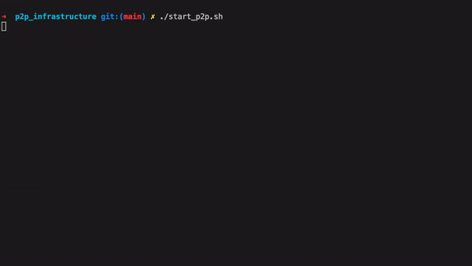

# p2p_infrastructure


## 系统要求
- Linux 
- Windows 10 64位
- MacOS


## 使用步骤

### 安装docker

根据[官方指南](https://docs.docker.com/get-docker/)安装对应版本的docker,并设置为开机启动

### 启动p2p网络


- MacOS

    -  首先安装 tuntap，在终端中运行
    ```bash
    brew tap homebrew/cask
    brew cask install tuntap
    ```

    If you are on a modern version of macOS (i.e. Catalina), the commands above will ask you to enable the TUN/TAP kernel extension in System Preferences → Security & Privacy → General.

    - 下载启动脚本 `start_p2p.sh`,并将脚本放到合适的地方
    
    - 在终端中启动脚本
    ```bash
    chmod +x start_p2p.sh
    ./start_p2p.sh
    ```
    - 根据提示输入姓名与手机号，以注册节点

    - 关闭脚本即退出p2p网络，每次启动p2p网络需要 __再次__ 运行脚本

- Windows

    - 安装 git [windows版本](https://git-scm.com/download/win)
    - 下载启动脚本 `start_p2p.sh`,并将脚本放到合适的地方
    
    - 以 `管理员身份` 中启动`git bash`, 并切换至脚本所在位置（cd）
    ```bash
    chmod +x start_p2p.sh
    ./start_p2p.sh
    ```
    - 根据提示输入姓名与手机号，以注册节点

    - 关闭脚本 __不会__ 退出p2p网络，每次重新启动电脑需要 __再次__ 运行脚本
 
    
- Ubuntu

    推荐使用运行在物理机上的Linux系统，如果使用WSL2或者虚拟机，请自行调整虚拟机工作模式为 单独网卡 模式
    
    - 下载启动脚本 `start_p2p.sh`,并将脚本放到合适的地方
    
    - 在终端中启动脚本
    ```bash
    chmod +x start_p2p.sh
    ./start_p2p.sh
    ```
    - 根据提示输入姓名与手机号，以注册节点

    - 关闭脚本 __不会__ 退出p2p网络，每次重新启动电脑需要 __再次__ 运行脚本
 

